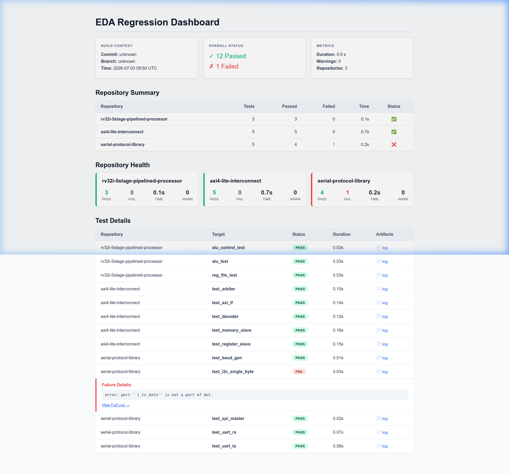
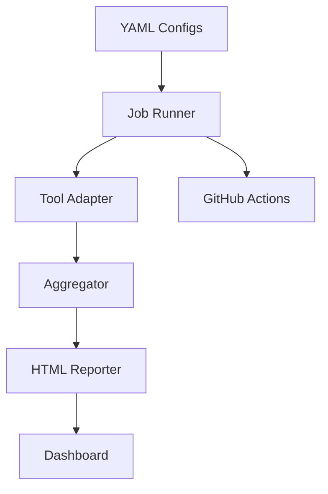

# EDA Regression Framework

> Python-based EDA regression framework with parallel execution, pluggable tool adapters, HTML reporting, and GitHub Actions CI for RTL and circuit simulation workflows.



### Dashboard Features
- ✓ Repository health
- ✓ Pass/Fail summary
- ✓ Execution duration
- ✓ Warning count
- ✓ Expandable error traces
- ✓ Log artifacts
- ✓ Commit metadata

## Why This Project?

Modern RTL and circuit simulation projects often contain dozens of testbenches spread across multiple repositories. Running them manually becomes slow and error-prone. This framework provides a unified, configuration-driven regression runner that executes tests in parallel, parses simulator output through pluggable adapters, and generates a CI-friendly HTML dashboard.

## Architecture



## Key Features

* **Parallel Regression Execution:** Test execution distributes asynchronously utilizing a `ProcessPoolExecutor`, dramatically lowering the execution runtime by parallelizing multiple repositories.
* **Config-driven Architecture:** New repositories can be fully integrated with a single YAML configuration file without writing any additional Python code.
* **Tool Adapter Architecture:** Log parsing is abstracted away through `ToolAdapter` subclasses. This eliminates the need to conform to a universal log format and works seamlessly across various simulators.
* **Interactive HTML Dashboard:** Outputs an interactive, responsive CI-style single-page HTML report summarizing pass/fail metrics, duration, warnings, errors, and providing immediate inline access to expanded error traces and test logs.
* **GitHub Actions Integration:** Full CI integration is provided via `.github/workflows/regression.yml` which triggers automated testing and artifact publication on every push.

## Supported Adapters

| Adapter             | Purpose                       |
| ------------------- | ----------------------------- |
| `IcarusAdapter`       | RTL simulation logs           |
| `NgspiceAdapter`      | Circuit simulation validation |
| `GenericRegexAdapter` | Configurable text parsing     |

## Project Structure

```text
eda-regression-framework/
├── configs/
├── reports/
├── src/
│   ├── adapters/
│   ├── report/
│   ├── runner/
│   └── cli.py
├── .github/
└── README.md
```

## Usage

### 1. Configuration

Define your testing targets via YAML (e.g., `configs/serial_protocol.yaml`):

```yaml
name: serial-protocol-library
repo_path: ../serial-protocol-library
test_targets:
  - name: test_uart_tx
    run_cmd: "make test_uart_tx"
    adapter: generic
    timeout_s: 30
```

### 2. Execution

To run all testing pipelines across all configured hardware repositories in parallel and instantly generate the CI dashboard:

```bash
# Install dependencies
pip install -r requirements.txt

# Run all pipelines and generate report
python3 -m src.cli run-all
```

The resulting HTML dashboard will be generated at `reports/index.html`.

### Example Dashboard Summary

```text
Overall Status

Repositories : 3
Passed       : 34
Failed       : 1
Duration     : 47.3 s
Commit       : a7f3d91
Branch       : main
```

## Validation

The framework has been validated against real hardware projects:

- RV32I Processor
- AXI4-Lite Interconnect
- Serial Protocol Library

During development it successfully detected a real regression in the serial protocol library (`test_i2c_single_byte`), demonstrating its effectiveness on production-style RTL repositories.


